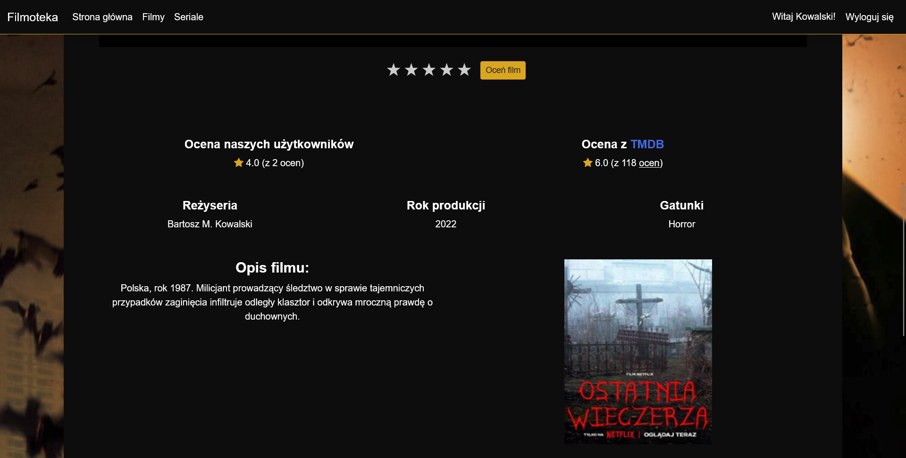
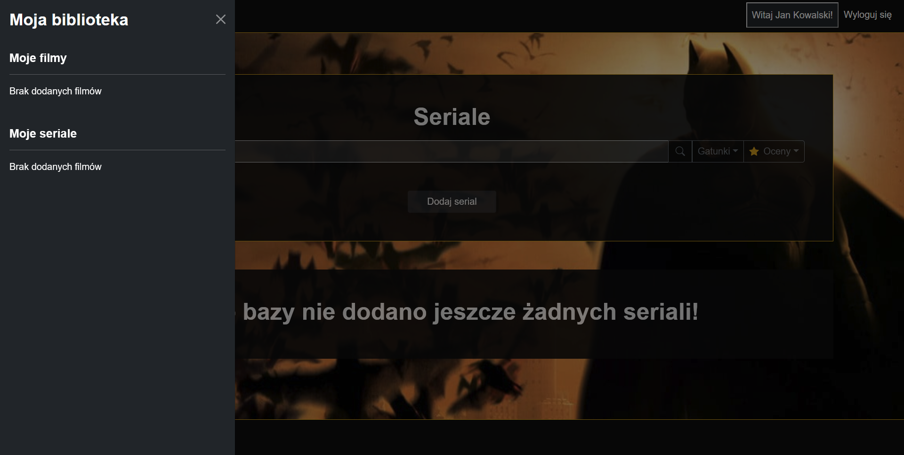
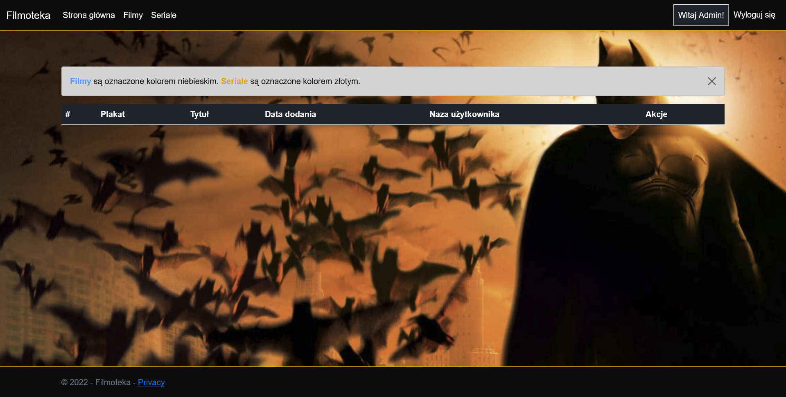

<div align="center">


&nbsp;

# **Filmoteka**

&nbsp;

##### Strona, której zadaniem jest umożliwić użytkownikom wybór idealnego filmu na wieczór. Każdy z użytkowników może dodawać filmy, komentarze i oceny do wybranej pozycji. Strona przyjemna i łatwa w odbiorze.

&nbsp;

&nbsp;

### **Adres strony**
http://filmotekaa-001-site1.atempurl.com/


</div>


&nbsp;

&nbsp;

&nbsp;

&nbsp;


<div align="right">

#### Autorzy &emsp;&emsp;&emsp;&nbsp;&nbsp;
##### Szymon Cieśla  &emsp;&emsp;&nbsp;
##### Szymon Zielonka  &emsp;

</div>


## Spis treści:
1. ##### [Work Breakdown Structure](#work-breakdown-structure)
2. ##### [Harmonogram](#harmonogram)
3. ##### [Specyfikacja wymagań biznesowch](#specyfikacja-wymagan-biznesowch)
    1. ##### [Poznaj Filmoteke!](#poznaj-filmoteke) 
    2. ##### [Wymagania funkcjonalne](#wymagania-funkcjonalne)
    3. ##### [Wymagania niefunkcjonalne](#wymagania-niefunkcjonalne)
    4. ##### [Opis ograniczeń systemu](#opis-ograniczen-systemu)
4. ##### [Dokumentacja techniczna](#dokumentacja-techniczna)
    1. ##### [Architektura systemu](#architektura-systemu)
    2. ##### [Struktura bazy danych](#struktura-bazy-danych)
    3. ##### [Diagram UML](#diagram-uml)
    4. ##### [Instalacja środowiska developerskiego](#instalacja-srodowiska-developerskiego) 
    5. ##### [Grafiki koncepcyjne](#grafiki-koncepcyjne)
5. ##### [Dokumentacja użytkownika](#dokumentacja-uzytkownika)
    1. ##### [Funkcjonalność Gościa](#funkcjonalność-goscia)
    2. ##### [Funkcjonalność Uzytkownika](#funkcjonalność-uzytkownika)
    3. ##### [Funkcjonalność Administratora](#funkcjonalność-administratora)


&nbsp;

## Work Breakdown Structure

&nbsp;

<div align="center">

#### Szymon Cieśla - Developer
#### Szymon Zielonka - Developer

&nbsp;

##### Spotkania 2 razy w tygodniu, czas pracy w przedziale od 2-5h.

</div>

&nbsp;

## Harmonogram

<div align="center">

&nbsp;

| Data zajęć | Opis realizowanych zagadnień |
| --- | --- |
| 05.10.2022 | Wypełnienie karty zadań |
| 12.10.2022 | Integracja z systemem GitLab |
| 19.10.2022 | Praca nad utworzeniem i hostingiem bazy danych, projekt diagramu UML, stworzenie wstępnych modeli oraz prace nad dokumentacją |
| 26.10.2022 | Projekt i implementacja kontrolerów oraz widoków filmów |
| 02.11.2022/09.11.2022 | Tworzenie widoków, implementacja modułu rejestracji i logowania |
| 16.11.2022 | Implementacja modułu odpowiedzialnego za dodawanie komentarzy do filmów i serialów oraz modułu odpowiedzialnego za ich oceny w systemie gwiazdkowym |
| 23.11.2022 | Utworzenie modułu do oglądania filmów oraz seriali |
| 30.11.2022 |Stworzenie modułu wyszukiwania i sortowania filmów. Utworzenie biblioteki dodanych filmów przez użytkownika oraz widoku strony głównej (projekt – 90% ukończenia, dokumentacja – 40%) |
| 07.12.2022 | Finalizacja pracy nad projektem i hostowanie aplikacji (projekt - 100%, dokumentacja 100%) |
| 14.12.2022 | Poprawa dokumentacji (projekt - 100%, dokumentacja 100%)  |
| 21.12.2022 | Prace konserwacyjne |
| 04.01.2023 | Prace konserwacyjne |
| 11.01.2023 | Prezentacje końcowych wersji projektów, oddanie dokumentacji |
| 18.01.2023 | Końcowe zaliczenie projektu |
</div>

#

# Specyfikacja wymagań biznesowch

## Poznaj Filmoteke

Szukasz idealnego filmu na wieczór? Myślisz że obejrzałeś już wszystkie filmy i seriale. Oto rozwiązanie dla Ciebie!  
**Filmoteka** jest to serwis internetowy który na celu ma ułatwić Tobie, naszemu użytkownikowi wybór idealnego filmu na wieczór na podstawie komentarzy oraz ocen innych użytkowników.


## Wymagania funkcjonalne

Dodawanie pozycji przez zalogowanych użytkowników. Zalogowani użytkownicymogą również oceniać inne pozycje oraz je komentować. Uprawenienia osób nie zalogowanych kończą się na przeglądaniu pozycji innych użytkowników. Strona umożliwia sortowanie po gatunkach oraz wyszukiwanie po tytule filmu. Administrator ma dostęp do wykresów statystycznych oraz posiada możliwość edycji każdego filmu i komentarza w bazie danych.

## Wymagania niefunkcjonalne

Aplikacja aplikacja ma być dostępna w systemie 24/7. Bezpieczeństwo danych użytkowników. Kontakt z administatorami przez email. Niezawodność i wydajność.

## Opis ograniczeń systemu

Największym i najbardziej poważnym ograniczeniem naszego systemu są prawa autorskie do filmów, seriali oraz ich elementów czyt. np. grafiki komercyjne. Strona powinna być prowadzona w taki sposób, by w jak najlepszy sposób nie konfliktować z prawem.


&nbsp;

# Dokumentacja techniczna

## Architektura systemu


Powyższy diagram ukazuje całe zaplecze technologiczne Filmoteki. Wykorzystujemy składowe ASP.NET Core Architecture. ASP.NET pozwala na budowanie wydajnych, wieloplatformowych aplikacji internetowych. Wzorce takie jak MVC i wbudowana obsługa Dependency Injection pozwalają na budowanie aplikacji, które są łatwiejsze w utrzymaniu.

&nbsp;

## Struktura bazy danych


Diagram ten przedstawia strukturę naszej bazy danych. Jak można zauważyć składa się ona z 10 tabel.

&nbsp;

## Diagram UML

Prezentujemy Diagram UML naszego dzieła.

## Instalacja środowiska developerskiego

1. Pobierz Visual Studio 22 z strony [Microsoftu](https://visualstudio.microsoft.com/pl/).
2. Zainstaluj Visual Studio wybierając następno wybrane moduły: 
3. Po pomyślnej instalacji programu do edycji kodu sklonuj repozytorium korzystając z tego linku:

```
https://gitlab.com/TestMyVeins/filmoteka.git
```
4. Środowisko jest gotowe do wprowadzania zmian

&nbsp;
## Grafiki koncepcyjne



&nbsp;

# Dokumentacja użytkownika
## Funkcjonalność Gościa

Przy wejściu na naszą stronę pojawiamy się na stronie głównej:


**Gość(*osoba niezalogowana*) może podjąć następujące działania:**
 
  - Stworzyć nowe konto: 
  - Zalogować się na istniejące konto: 
  - Przypomnieć hasło do istniejącego konta: 
  - Ponowić wysłanie linku aktywacyjnego do konta: 
  - Przeglądać dodane filmy: 
  - Przeglądać dodane seriale: 
  - Korzystać z wyszukiwania pozycji: 
  - Wyświetlać pozycje filmów i seriali: 

## Funkcjonalność Uzytkownika

**Użytkownik jest rozszerzeniem roli Gościa, posiada on dodatkowe uprawnienia, przez które może dodatkowo:**

  - Oceniać pozycje filmów i seriali. Ocena może być wydana tylko raz i nie może być potem zmieniona: 
  - Dodawać komentarze do filmów i seriali: 
  - Dodawać linki do hostingów z filmem, by umożliwić oglądanie filmów użytkownikom: 
  - Oglądać filmy i seriale: 
  - Dodawać nowe pozycje do filmów i seriali: 
  - Przeglądać i śledzić dodane przez siebie pozycje: 
   - Wylogować się: 
  
## Funkcjonalność Administratora

**Administrator jest rozszerzeniem roli Użytkownika, posiada on dodatkowe uprawnienia**

Przy zalogowaniu się na użytkownika z rolą Administratora pojawia się panel administratora:


  
Z tego miejsca administrator może wykonać następujące działania:
  - Zatwierdzać dodane filmy i seriale: 
  - Anulować dodane filmy i seriale: 
  - Przeglądać statystyki filmów: 
  *Wykres ilustrujący ile zostało dodanych filmów w poszczególnych miesiącach*
  
  *Wykres ilustrujący ile filmów poszczególnych gatunków zostało dodanych w wybranym miesiącu*
  
  *Wykres ilustrujący oceny filmów wybranego gatunku*

  - Przeglądać statystyki seriali: 
  
  *Wykres ilustrujący ile zostało dodanych seriali w poszczególnych miesiącach*
  
  *Wykres ilustrujący ile seriali poszczególnych gatunków zostało dodanych w wybranym miesiącu*
  
  *Wykres ilustrujący oceny seriali wybranego gatunku*


#
